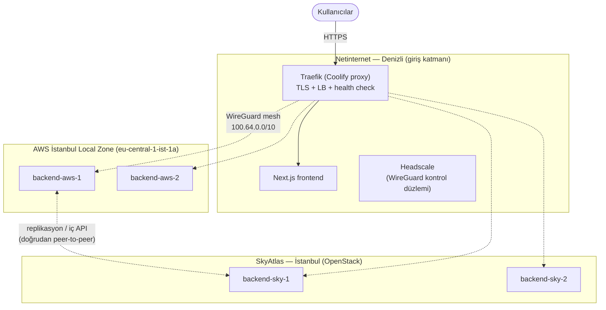

# Hibrit Altyapı Mimarisi — Netinternet + AWS İstanbul Local Zone + SkyAtlas

> Durum: **Tasarım onaylandı, kurulum bekliyor.**
> Kapsam: Giriş katmanı (LB + frontend) Netinternet Denizli'de, backend'ler AWS
> İstanbul Local Zone ve SkyAtlas İstanbul'da; tüm siteler tek bir WireGuard
> mesh'i (Headscale kontrol düzlemi) ile birbirine bağlı.

---

## 1. Özet

| Katman | Nerede | Ne çalışıyor |
| --- | --- | --- |
| Giriş / LB / Frontend | **Netinternet (Denizli)** — VDS veya bare metal | Coolify → Traefik (TLS + reverse proxy + LB), Next.js frontend, Headscale |
| Backend A | **AWS İstanbul Local Zone** (`eu-central-1-ist-1a`, ana bölge Frankfurt) | Backend API instance'ları (C7i/M7i/R7i) |
| Backend B | **SkyAtlas (İstanbul)** — OpenStack | Backend API VM'leri |
| Özel ağ | Üç site arası | WireGuard mesh (Tailscale istemcileri + self-host Headscale) |

Temel ilkeler:

- **Tüm veri Türkiye'de kalır.** Giriş noktası, backend'ler ve kontrol düzlemi
  yurtiçinde; KVKK m.9 kapsamında yurt dışına aktarım oluşmaz (bkz. §4).
- **Backend'ler internete kapalıdır.** Uygulama portları yalnızca WireGuard
  arayüzünden (100.64.0.0/10) dinler; dışarıya açık tek şey kilitli WireGuard
  UDP portudur.
- **Ayrı LB cihazı, ayrı VPN cihazı yok.** LB = Netinternet'teki Traefik;
  VPN = her makinenin üzerinde çalışan Tailscale istemcisi.

## 2. Mimari



Trafik akışı:

1. Kullanıcı → Netinternet'teki Traefik (TLS burada sonlanır).
2. Frontend istekleri lokal Next.js'e; `/api` istekleri WireGuard mesh
   üzerinden AWS LZ + SkyAtlas backend havuzuna ağırlıklı round-robin ile
   dağıtılır (Traefik health check'leri sağlıksız node'u otomatik düşürür).
3. Siteler arası doğu-batı trafiği (DB replikasyonu, iç API) mesh üzerinden
   **doğrudan** AWS ↔ SkyAtlas akar; Denizli'ye uğramaz.

## 3. Karar kaydı — neye karar verdik, neden

| Karar | Gerekçe |
| --- | --- |
| **Cloudflare LB kullanılmıyor** | Proxy modunda trafik yurt dışı PoP'larda çözülür → KVKK m.9 yurt dışı aktarım dosyası (Türk SCC imzası + 5 iş günü bildirim) gerekir. Yurtiçi giriş katmanıyla bu yük tamamen kalkıyor. İleride WAF/CDN gerekirse DNS-only mod veya Regional Services "Türkiye" bölgesi yeniden değerlendirilebilir. |
| **AWS ALB kullanılmıyor** | Giriş kapısı Netinternet'e taşınınca ALB'nin işi kalmadı; yük dağıtımı/health check/TLS Traefik'te. ALB maliyeti (aylık sabit + LCU) de düşüyor. |
| **AWS yönetilen Site-to-Site VPN kullanılmıyor** | Yönetilen VPN (VGW/TGW) Local Zone'da sonlanamaz, Frankfurt'ta sonlanır → trafik İstanbul→Frankfurt→İstanbul dolaşır. AWS'nin Local Zone için resmî önerisi zaten instance üzerinde yazılım VPN'idir. |
| **Ayrı VPN gateway makineleri kurulmuyor** | WireGuard her backend'in üzerinde servis olarak çalışır; ayrı kutu ancak site başına makine sayısı çok artarsa veya WireGuard koşamayan yönetilen servisler (ör. RDS) tünele girecekse gerekir. O durumda da mevcut bir backend `--advertise-routes` ile subnet gateway yapılır, yeni makine alınmaz. |
| **Kontrol düzlemi self-host (Headscale)** | Tailscale SaaS kullanılsaydı koordinasyon metadata'sı (cihaz adları, IP'ler, anahtarlar, kullanıcı e-postaları) ABD'ye giderdi. Headscale Netinternet'te çalışır; her şey yurtiçi. |

## 4. KVKK notları

- Kişisel veri barındıran tüm bileşenler (giriş, backend, log, kontrol düzlemi)
  Türkiye'de → **yurt dışına aktarım yok**, m.9 mekanizmalarına (SCC, BCR,
  taahhütname) gerek yok.
- Bu, aydınlatma/VERBİS/veri güvenliği gibi genel yükümlülükleri kaldırmaz;
  yalnızca aktarım boyutunu sadeleştirir.
- Dikkat: İleride eklenecek her dış servis (izleme, hata takibi, e-posta,
  CDN...) bu tabloyu bozabilir. Yeni servis eklerken "veri nerede işleniyor?"
  sorusu bu dokümana işlenmelidir.
- Nihai uyum değerlendirmesi için hukuk görüşü alınmalıdır; bu doküman
  mühendislik seviyesinde bir özettir.

## 5. Ağ tasarımı

### 5.1 IP planı

| Ağ | CIDR | Not |
| --- | --- | --- |
| AWS VPC (Frankfurt ana bölge + LZ subnet) | `10.10.0.0/16` | LZ subnet örn. `10.10.1.0/24` |
| SkyAtlas özel ağ | `10.20.0.0/16` | |
| Netinternet (lokal) | sunucunun kendi IP'si | |
| **WireGuard mesh (Tailscale/Headscale)** | `100.64.0.0/10` içinden otomatik | Uygulamalar **bu** IP'leri kullanır |

Uygulama trafiği için siteler arası yönlendirme tablosu **gerekmez**: her
makine mesh'te kendi `100.64.x.x` adresini alır, Traefik upstream'leri ve
replikasyon bağlantıları bu adreslere (veya MagicDNS adlarına, ör.
`backend-aws-1.tailnet`) kurulur.

### 5.2 Güvenlik duvarı kuralları

**AWS LZ instance'ları** (Local Zone'da NAT Gateway olmadığından public IP
zorunlu; tehlikeli değil, çünkü açık tek port WireGuard):

| Yön | Port | Kaynak | Amaç |
| --- | --- | --- | --- |
| Gelen | UDP 41641 | Netinternet çıkış IP'si, SkyAtlas floating IP'leri | WireGuard/Tailscale doğrudan bağlantı |
| Gelen | — | (yok) | Uygulama portları internete **kapalı** |
| Giden | 443/TCP, UDP | serbest | Headscale'e kayıt, paket güncellemeleri |

**SkyAtlas VM'leri**: aynı mantık (security group + floating IP).

**Netinernet sunucusu**: 80/443 (Traefik), UDP 41641 (WireGuard),
443'te Headscale (Traefik arkasında ayrı hostname, ör.
`headscale.example.com`), SSH yalnızca yönetim IP'lerinden.

Uygulama servisleri her makinede yalnızca `tailscale0` arayüzüne bind edilir
(`listen 100.64.x.x:3000` veya Docker'da `--publish 100.64.x.x:3000:3000`).

### 5.3 Kontrol düzlemi: Headscale

Headscale, Netinternet sunucusunda Coolify üzerinden konteyner olarak çalışır:

```yaml
# coolify: headscale servisi (özet docker-compose)
services:
  headscale:
    image: headscale/headscale:latest
    command: serve
    volumes:
      - ./config:/etc/headscale
      - ./data:/var/lib/headscale
    # Traefik arkasında: headscale.example.com -> 8080
```

`config.yaml` içinde önemli ayarlar:

- `server_url: https://headscale.example.com`
- `derp.server.enabled: true` — **gömülü DERP relay'i açın.** NAT geçişi
  başarısız olursa trafik Tailscale'in yurt dışı relay'lerine değil, kendi
  sunucunuzdaki relay'e düşer (uçtan uca şifreli olsa da yurtiçinde kalması
  KVKK tablosunu sade tutar).
- `dns.magic_dns: true` — makinelere `backend-aws-1.<tailnet>` gibi adlar.

Node kaydı:

```bash
# Netinternet sunucusunda (bir kez):
headscale users create prod
headscale preauthkeys create --user prod --reusable --expiration 24h

# Her backend'de (AWS LZ + SkyAtlas + Netinternet'in kendisi):
curl -fsSL https://tailscale.com/install.sh | sh
tailscale up --login-server https://headscale.example.com \
             --auth-key <PREAUTH_KEY> --hostname backend-aws-1
```

### 5.4 Yük dağıtımı: Traefik

Coolify'ın proxy'sine (Traefik) file-provider ile dinamik config eklenir
(Coolify panelinde *Proxy → Dynamic Configurations*):

```yaml
# dynamic/backend-pool.yaml
http:
  routers:
    api:
      rule: "Host(`example.com`) && PathPrefix(`/api`)"
      service: backend-pool
      entryPoints: [https]
      tls: { certResolver: letsencrypt }
  services:
    backend-pool:
      loadBalancer:
        healthCheck: { path: /healthz, interval: 10s, timeout: 3s }
        servers:
          - url: "http://100.64.0.2:3000"   # backend-aws-1
          - url: "http://100.64.0.3:3000"   # backend-aws-2
          - url: "http://100.64.0.4:3000"   # backend-sky-1
          - url: "http://100.64.0.5:3000"   # backend-sky-2
```

Ağırlıklı dağıtım gerekirse (`weighted` service) AWS/SkyAtlas havuzları ayrı
service olarak tanımlanıp oranlanır. Oturum yapışkanlığı gerekiyorsa
`sticky.cookie` eklenir.

## 6. Tailscale / Headscale — nedir, ne değildir

### Nedir?

- **WireGuard**: çekirdek seviyesinde çalışan, modern ve çok hızlı bir VPN
  protokolü. "Tünelin kendisi" budur; iki makine birbirinin açık anahtarını ve
  adresini bilirse şifreli konuşur. Zayıf yanı operasyondur: anahtar dağıtımı,
  peer listeleri, IP planı, NAT geçişi elle yönetilir.
- **Tailscale**: WireGuard'ın üzerine kurulmuş bir *mesh VPN ürünü*. Her
  makineye bir istemci kurulur; makineler tek bir özel ağa ("tailnet") katılır,
  `100.64.0.0/10` aralığından kalıcı IP alır ve birbirleriyle **doğrudan,
  uçtan uca şifreli** konuşur. Anahtar dağıtımı, peer keşfi, NAT geçişi, cihaz
  ekleme/çıkarma ve erişim kuralları (ACL) merkezi bir **koordinasyon
  sunucusu** tarafından otomatik yönetilir. Tailscale'in kendi koordinasyon
  sunucusu ABD'de çalışan bir SaaS'tır.
- **Headscale**: Tailscale koordinasyon sunucusunun açık kaynak, self-host
  edilebilir muadili. Resmî Tailscale istemcileriyle çalışır (`tailscale up
  --login-server ...`); tek Go binary'si/konteyner. Bizim kurguda Netinternet
  sunucusunda çalışır → kontrol düzlemi de yurtiçinde.

### Ne değildir?

- **Trafiğinizi gören/taşıyan bir merkez değildir.** Koordinasyon sunucusu
  (Tailscale SaaS da, Headscale de) yalnızca *metadata* yönetir: açık
  anahtarlar, cihaz adları, IP atamaları, ACL'ler. Veri trafiği makineler
  arasında **doğrudan** akar; özel anahtarlar makineden hiç çıkmaz.
  Koordinasyon sunucusu çökse bile mevcut tüneller çalışmaya devam eder —
  yalnızca yeni cihaz ekleme/anahtar yenileme bekler.
- **Klasik "VPN concentrator" değildir.** Bütün trafiğin içinden geçtiği tek
  bir kutu yoktur (o modeli bilerek terk ettik). İstisna: doğrudan bağlantı
  kurulamayan NAT durumlarında devreye giren DERP relay'leri — bunlar da
  uçtan uca şifreyi açamaz, sadece paket taşır; Headscale'de gömülü DERP ile
  bu rol de kendi sunucumuzda.
- **Firewall/ACL sisteminizin yerine geçmez.** Tailscale ACL'leri mesh içi
  erişimi kısıtlar, ama security group'lar ve host firewall'ları yine gerekir
  (savunma katmanlıdır).
- **Headscale, Tailscale Inc.'in resmî/SLA'lı ürünü değildir.** Aktif ve
  Tailscale'in de dostane baktığı bir topluluk projesidir; kurumsal SaaS
  özelliklerinin bir kısmı (çoklu tailnet paylaşımı, hazır admin paneli,
  destek sözleşmesi) yoktur. Bizim ölçeğimiz (üç site, ~5-10 makine) için
  fazlasıyla yeterlidir.
- **Zorunlu değildir.** Aynı mesh 3-4 makine için elle yazılmış WireGuard
  config'leriyle de kurulabilir. Headscale'i seçme nedenimiz operasyon
  konforu (yeni makine eklemek tek komut) ve anahtar yönetiminin
  otomatikleşmesidir.

### Neden Tailscale SaaS değil de Headscale?

| | Tailscale SaaS | Headscale (seçilen) |
| --- | --- | --- |
| Kontrol düzlemi nerede | ABD (Tailscale Inc.) | Netinternet, Denizli |
| KVKK'ya etki | Koordinasyon metadata'sı yurt dışına gider (müşteri verisi değil ama tabloyu kirletir) | Her şey yurtiçi |
| Relay (DERP) | Tailscale'in global relay'leri | Gömülü DERP, kendi sunucumuz |
| İşletme yükü | Sıfır | Bir konteyner + yedeği bize ait |
| SSO/MFA, hazır panel | Var | Sınırlı (CLI + topluluk UI'ları) |

## 7. Yüksek erişilebilirlik ve bilinen riskler

- **Netinternet tek giriş noktasıdır** (tek DC, tek sunucu). Plan: ikinci bir
  LB/frontend node'u (Netinternet'te ikinci sunucu veya AWS LZ'de yedek) +
  düşük TTL DNS failover. Coolify çoklu sunucu yönetebildiğinden deployment
  aynı panelden sürer.
- **Denizli ↔ İstanbul gecikmesi** (~10-15 ms RTT) her API isteğine eklenir.
  Azaltma: API çağrılarını toplulaştırma, frontend cache, gerekirse sık
  okunan veriyi giriş katmanında replikalama.
- **AWS LZ tek zone'dur** (`eu-central-1-ist-1a`); AZ-çeşitliliği yoktur.
  SkyAtlas havuzu bu riskin doğal yedeğidir — kapasite planı "tek site tüm
  yükü taşıyabilir" varsayımıyla yapılmalıdır.
- **Headscale/DERP sunucusu** Netinternet'teki makinede: config + SQLite
  verisi günlük yedeklenmeli. Kontrol düzlemi çökerse mevcut tüneller çalışır;
  panik gerektirmez ama izlenmelidir.
- **DDoS**: Netinternet'in ücretsiz volumetrik koruması + (opsiyonel) HEIMWALL
  WAF. Cloudflare seviyesinde küresel koruma değildir; risk kabul edilmiştir,
  gerekirse DNS-only Cloudflare yeniden değerlendirilir.

## 8. Kurulum sırası (runbook özeti)

1. **Netinternet**: VDS/bare metal + Ubuntu LTS → Coolify kur → Traefik ayakta.
2. **Headscale**: Coolify'da konteyner + `headscale.example.com` hostname'i,
   gömülü DERP açık. `prod` kullanıcısı + preauth key üret.
3. **AWS**: Frankfurt'ta VPC (`10.10.0.0/16`) → İstanbul LZ subnet
   (`eu-central-1-ist-1a`) → backend instance'ları (public IP + §5.2 SG) →
   `tailscale up --login-server ...`.
4. **SkyAtlas**: özel ağ (`10.20.0.0/16`) + backend VM'leri (floating IP +
   security group) → `tailscale up --login-server ...`.
5. **Uygulama**: backend servislerini yalnızca `tailscale0` arayüzüne bind et;
   Traefik dynamic config'e (§5.4) mesh IP'lerini yaz; health check doğrula.
6. **Frontend**: Next.js'i Coolify'a deploy et; `/api` yönlendirmesini test et.
7. **Kesinti tatbikatı**: bir backend'i kapat → Traefik'in düşürdüğünü,
   trafiğin diğer siteye aktığını doğrula. AWS↔SkyAtlas replikasyon
   bağlantısını mesh IP'leri üzerinden kur ve test et.

## 9. Kaynaklar

- [AWS Local Zones — VPN bağlantısı](https://docs.aws.amazon.com/local-zones/latest/ug/local-zones-connectivity-ec2-vpn.html)
- [AWS İstanbul Local Zone duyurusu](https://aws.amazon.com/blogs/infrastructure-sustainability/now-open-aws-local-zones-in-istanbul-turkiye/)
- [Headscale dokümantasyonu](https://headscale.net/)
- [Tailscale — How Tailscale works](https://tailscale.com/blog/how-tailscale-works)
- [Traefik — Load balancing / health checks](https://doc.traefik.io/traefik/routing/services/)
- [Coolify dokümantasyonu](https://coolify.io/docs)
- [KVKK m.9 değişikliği ve yurt dışı aktarım rejimi (2024)](https://paksoy.av.tr/en/2024/07/turkish-data-protection-authority-issues-new-regulation-on-cross-border-data-transfers/)
- [Netinternet](https://www.netinternet.tr/en/about-us)
